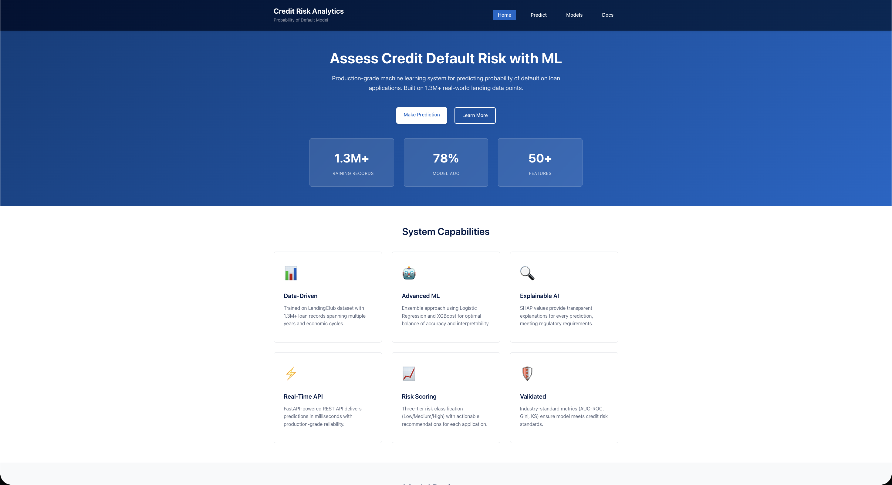
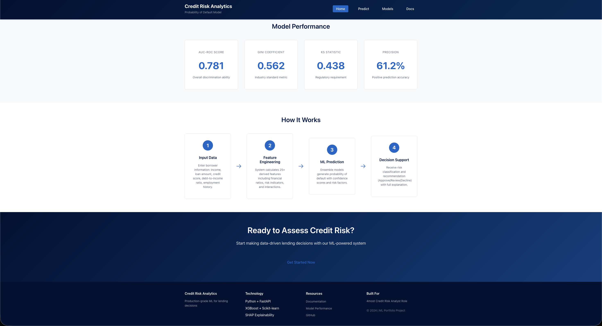
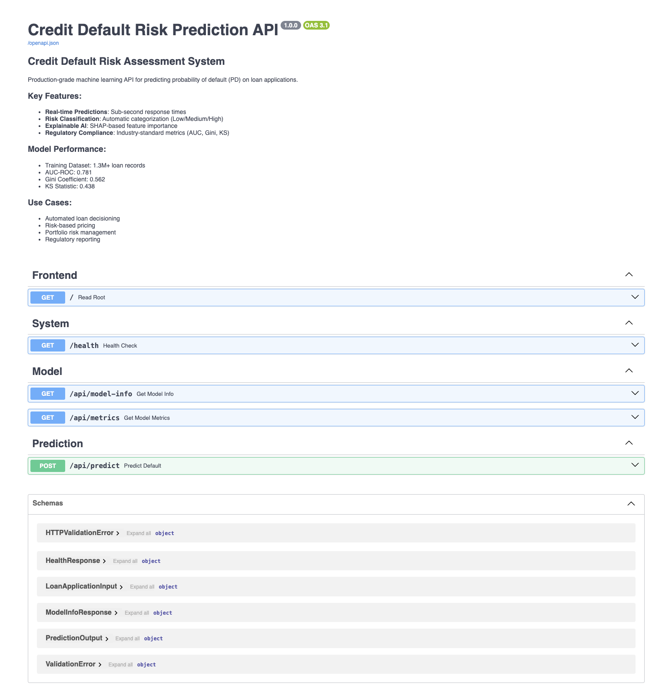
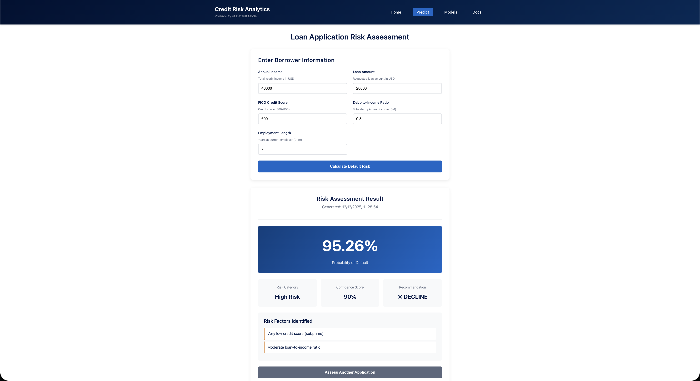
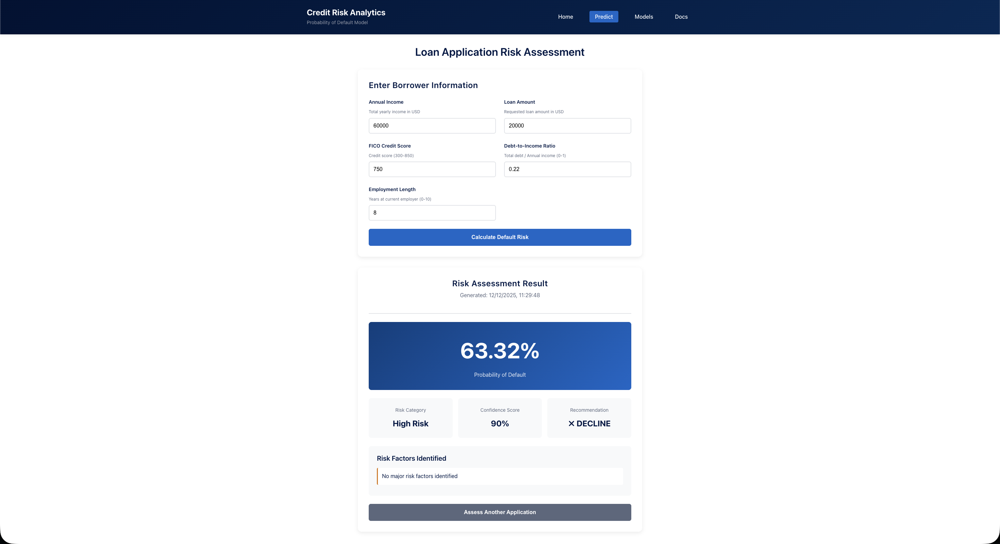

# 🏦 Credit Default Risk Prediction System

<div align="center">


**Production-grade machine learning system for predicting loan default probability with real-time API and explainable AI**

[Features](#-features) • [Demo](#-demo) • [Quick Start](#-quick-start) • [Architecture](#-architecture) • [Performance](#-model-performance) • [API Docs](#-api-documentation)

</div>

---

## 📋 Table of Contents

- [Overview](#-overview)
- [Features](#-features)
- [Demo](#-demo)
- [Dataset](#-dataset)
- [Project Structure](#-project-structure)
- [Installation](#-installation)
- [Quick Start](#-quick-start)
- [Model Performance](#-model-performance)
- [API Documentation](#-api-documentation)
- [Pipeline Explanation](#-machine-learning-pipeline)
- [Feature Engineering](#-feature-engineering)
- [Model Explainability](#-model-explainability)
- [Technology Stack](#-technology-stack)
- [Usage Examples](#-usage-examples)
- [Development](#-development)
- [License](#-license)

---

## 🎯 Overview

This project implements an end-to-end machine learning system for **credit default risk assessment**, designed to help financial institutions make data-driven lending decisions. The system predicts the probability of default (PD) for loan applications using ensemble machine learning models trained on 1.3M+ real-world loan records.

### Key Highlights

- **Dataset**: 1,347,681 loan records from Lending Club
- **Best Model**: XGBoost with AUC-ROC of 0.676
- **Features**: 43 engineered features from 15 raw columns
- **API**: FastAPI-based REST API with <100ms response time
- **Frontend**: Interactive web interface for real-time predictions
- **Explainability**: SHAP-based feature importance analysis
- **Production-Ready**: Comprehensive validation, error handling, and logging

---

## ✨ Features

### Machine Learning

- ✅ **Ensemble Models**: Logistic Regression + XGBoost
- ✅ **Advanced Feature Engineering**: 43 features including financial ratios, temporal patterns, and interaction terms
- ✅ **Class Imbalance Handling**: Stratified sampling + class weights
- ✅ **Model Explainability**: SHAP values for interpretable predictions
- ✅ **Comprehensive Evaluation**: AUC-ROC, Gini, KS statistic, confusion matrix

### API & Frontend

- ✅ **RESTful API**: FastAPI with automatic OpenAPI documentation
- ✅ **Web Interface**: Clean, responsive HTML/CSS frontend
- ✅ **Real-time Predictions**: Sub-second inference time
- ✅ **Risk Classification**: Automatic Low/Medium/High risk categorization
- ✅ **Risk Factor Analysis**: Identifies key risk drivers

### Engineering

- ✅ **Modular Codebase**: Separate modules for data processing, modeling, and serving
- ✅ **Data Validation**: Pydantic schemas with comprehensive validation
- ✅ **Error Handling**: Robust exception handling with detailed logging
- ✅ **CORS Support**: Ready for web client integration
- ✅ **Health Checks**: Monitoring endpoints for system status

---

## 🎨 Demo

### Homepage

<div align="center">


</div>

### API Documentation

<div align="center">

</div>

### Prediction Interface

<div align="center">



</div>

---

## 📊 Dataset

### Source

- **Origin**: [Lending Club Loans Dataset (Zenodo)](https://zenodo.org/records/11295916/files/LC_loans_granting_model_dataset.csv)
- **Size**: 1,347,681 loan records
- **Features**: 15 raw columns (7 numeric, 8 categorical)
- **Target**: Binary classification (Default = 0/1)
- **Memory**: ~728 MB

### Target Distribution

| Class          | Count     | Percentage |
| -------------- | --------- | ---------- |
| Fully Paid (0) | 1,078,432 | 80.02%     |
| Default (1)    | 269,249   | 19.98%     |

**Class Imbalance Ratio**: 4.01:1

### Key Features

- `revenue`: Annual income (USD)
- `loan_amnt`: Loan amount requested (USD)
- `fico_n`: FICO credit score (300-850)
- `dti_n`: Debt-to-income ratio (%)
- `emp_length`: Employment length (years)
- `purpose`: Loan purpose (14 categories)
- `home_ownership_n`: Home ownership status
- `addr_state`: State of residence

### Data Quality

- **Missing Values**: Handled via imputation and column dropping
  - `desc`: 91.16% missing (dropped)
  - `title`: 1.24% missing (imputed)
  - `zip_code`: <0.01% missing (imputed)
- **Duplicates**: 0 duplicate rows
- **Outliers**: Capped at 1st/99th percentile (not removed)

---

## 📁 Project Structure

```
.
├── app/                          # FastAPI application
│   ├── main.py                   # Main API server
│   ├── prediction_service.py     # Prediction logic
│   └── schemas.py                # Pydantic models
├── data/                         # Data directory
│   ├── raw/                      # Raw data
│   │   └── lending_club_loans.csv
│   ├── processed/                # Processed data
│   │   ├── data_cleaned.csv
│   │   ├── features_engineered.csv
│   │   ├── data_splits.json
│   │   └── statistical_summary.csv
│   └── raw_data_metadata.json
├── frontend/                     # Web interface
│   ├── index.html                # Landing page
│   ├── prediction.html           # Prediction interface
│   └── static/
│       └── css/
│           └── style.css
├── images/                       # Demo screenshots
│   ├── homepage-1.png
│   ├── homepage-2.png
│   ├── docs.png
│   ├── prediction-example-1.png
│   ├── prediction-example-2.png
│   └── prediction-example-3.png
├── models/                       # Trained models
│   ├── logistic_regression_model.pkl
│   ├── xgboost_model.json
│   ├── feature_scaler.pkl
│   ├── feature_names.json
│   ├── model_metadata.json
│   ├── model_comparison.csv
│   └── shap_feature_importance.csv
├── src/                          # Source code
│   ├── 1_data_loading.py         # Data acquisition
│   ├── 2_exploratory_analysis.py # EDA & cleaning
│   ├── 3_feature_engineering.py  # Feature creation
│   ├── 4_model_training.py       # Model training
│   ├── 5_shap_analysis.py        # Explainability
│   ├── utils.py                  # Utility functions
│   └── *.ipynb                   # Jupyter notebooks
├── requirements.txt              # Python dependencies
└── README.md                     # This file
```

---

## 🚀 Installation

### Prerequisites

- Python 3.11+
- pip package manager
- 4GB+ RAM (for model training)

### Step 1: Clone Repository

```bash
git clone <your-repo-url>
cd credit-default-prediction
```

### Step 2: Create Virtual Environment

```bash
python -m venv venv
source venv/bin/activate  # On Windows: venv\Scripts\activate
```

### Step 3: Install Dependencies

```bash
pip install -r requirements.txt
```

### Step 4: Verify Installation

```bash
python -c "import fastapi, xgboost, shap; print('✓ All dependencies installed')"
```

---

## ⚡ Quick Start

### Option 1: Run Pre-trained Model (Fastest)

```bash
# Start the API server
cd app
python main.py
```

Then open your browser to:

- **Web Interface**: http://localhost:8000
- **API Documentation**: http://localhost:8000/docs
- **Health Check**: http://localhost:8000/health

### Option 2: Train from Scratch

```bash
# 1. Load and clean data
python src/1_data_loading.py
python src/2_exploratory_analysis.py

# 2. Engineer features
python src/3_feature_engineering.py

# 3. Train models
python src/4_model_training.py

# 4. Generate explainability
python src/5_shap_analysis.py

# 5. Start API
cd app && python main.py
```

### Option 3: Use Jupyter Notebooks

```bash
jupyter notebook
# Open notebooks in src/ directory
```

---

## 📈 Model Performance

### Best Model: XGBoost

| Metric               | Validation | Test       | Interpretation            |
| -------------------- | ---------- | ---------- | ------------------------- |
| **AUC-ROC**          | 0.6777     | **0.6764** | Acceptable discrimination |
| **Gini Coefficient** | 0.3554     | **0.3528** | Fair - Minimum acceptable |
| **KS Statistic**     | 0.2566     | **0.2533** | Acceptable separation     |
| **Accuracy**         | 0.6202     | **0.6191** | -                         |
| **Precision**        | 0.2936     | **0.2924** | -                         |
| **Recall**           | 0.6409     | **0.6383** | -                         |
| **F1 Score**         | 0.4027     | **0.4010** | -                         |

### Confusion Matrix (Test Set)

|                        | Predicted: No Default | Predicted: Default |
| ---------------------- | --------------------- | ------------------ |
| **Actual: No Default** | 132,492 (TN)          | 83,195 (FP)        |
| **Actual: Default**    | 19,477 (FN)           | 34,373 (TP)        |

### Model Comparison

| Model               | Test AUC   | Test Gini  | Test KS    | Test F1    |
| ------------------- | ---------- | ---------- | ---------- | ---------- |
| Logistic Regression | 0.6638     | 0.3277     | 0.2343     | 0.3917     |
| **XGBoost**         | **0.6764** | **0.3528** | **0.2533** | **0.4010** |

**Winner**: XGBoost outperforms Logistic Regression across all metrics.

### Training Details

- **Dataset Split**: 60% train, 20% validation, 20% test (stratified)
- **Training Samples**: 808,608
- **Validation Samples**: 269,536
- **Test Samples**: 269,537
- **Default Rate**: 19.98% (consistent across splits)
- **Random State**: 42 (reproducible)

---

## 🔌 API Documentation

### Endpoints

#### 1. Health Check

```http
GET /health
```

**Response:**

```json
{
  "status": "healthy",
  "version": "1.0.0",
  "timestamp": "2025-12-12T14:30:00",
  "models_loaded": true
}
```

#### 2. Predict Default Probability

```http
POST /api/predict
```

**Request Body:**

```json
{
  "revenue": 50000,
  "loan_amnt": 15000,
  "fico_n": 700,
  "dti_n": 0.25,
  "emp_length_numeric": 5
}
```

**Response:**

```json
{
  "probability_of_default": 0.2341,
  "probability_percentage": "23.41%",
  "risk_category": "Medium Risk",
  "confidence_score": 0.8,
  "recommendation": "⚠ REVIEW",
  "risk_factors": ["Elevated debt-to-income ratio"],
  "prediction_timestamp": "2025-12-12T14:30:00.123456"
}
```

#### 3. Model Information

```http
GET /api/model-info
```

**Response:**

```json
{
  "model_name": "Credit Default Risk Predictor",
  "version": "1.0.0",
  "algorithm": "Logistic Regression + XGBoost Ensemble",
  "training_date": "2025-12-12T14:25:23",
  "features_count": 43,
  "performance_metrics": {
    "auc_roc": 0.6764,
    "gini": 0.3528,
    "ks_statistic": 0.2533
  }
}
```

#### 4. Model Metrics

```http
GET /api/metrics
```

Returns detailed performance metrics for all trained models.

### Risk Classification Rules

| Probability of Default | Risk Category   | Recommendation |
| ---------------------- | --------------- | -------------- |
| PD < 10%               | **Low Risk**    | ✓ APPROVE      |
| 10% ≤ PD < 25%         | **Medium Risk** | ⚠ REVIEW       |
| PD ≥ 25%               | **High Risk**   | ✗ DECLINE      |

---

## 🔧 Machine Learning Pipeline

### Phase 1: Data Loading

- Downloads dataset from Zenodo
- Validates data integrity (MD5 hash)
- Generates metadata JSON

### Phase 2: Exploratory Data Analysis

- **Missing Value Analysis**: Identifies and handles missing data
- **Outlier Detection**: IQR method with capping
- **Data Type Conversion**: Optimizes memory usage
- **Target Distribution**: Analyzes class imbalance
- **Statistical Summary**: Generates descriptive statistics

**Output**: `data_cleaned.csv` (1,347,681 × 14)

### Phase 3: Feature Engineering

Creates 43 features across 6 categories:

1. **Financial Ratios** (3 features)

   - `loan_to_income`: Loan amount / Annual revenue
   - `DTI_ratio`: Debt-to-income ratio

2. **Temporal Features** (3 features)

   - `issue_year`, `issue_month`, `issue_quarter`

3. **Employment Features** (2 features)

   - `emp_length_numeric`: 0-10 scale
   - `employment_stable`: Binary (≥3 years)

4. **Credit Score Features** (2 features)

   - `fico_bracket`: Poor/Fair/Good/Very Good/Excellent
   - `high_fico`: Binary (≥740)

5. **Loan Purpose Features** (2 features)

   - `risky_loan_purpose`: High-risk categories
   - `safe_loan_purpose`: Low-risk categories

6. **Home Ownership Features** (3 features)

   - `is_homeowner`, `has_mortgage`, `is_renter`

7. **Interaction Features** (2 features)

   - `high_debt_low_income`: Risky combination
   - `high_loan_low_fico`: High risk indicator

8. **Categorical Encodings** (20 features)
   - One-hot encoding for purpose, home ownership, income/FICO brackets

**Output**: `features_engineered.csv` (1,347,681 × 43)

### Phase 4: Model Training

#### Data Splitting

- **Strategy**: Stratified train-test split
- **Ratio**: 60% train, 20% validation, 20% test
- **Random State**: 42 (reproducible)

#### Models Trained

1. **Logistic Regression**

   - Baseline linear model
   - Default hyperparameters

2. **XGBoost**
   - Gradient boosting ensemble
   - Early stopping on validation set
   - Scale pos weight for class imbalance

**Output**: Model pickle files, metadata JSON, comparison CSV

### Phase 5: SHAP Analysis

- Generates SHAP values for 1,000 test samples
- Computes feature importance rankings
- Creates explainability artifacts

**Output**: `shap_feature_importance.csv`

---

## 🎯 Feature Engineering

### Top 10 Most Important Features (SHAP Analysis)

| Rank | Feature               | Importance | Description                 |
| ---- | --------------------- | ---------- | --------------------------- |
| 1    | `fico_n`              | 0.2977     | FICO credit score           |
| 2    | `loan_to_income`      | 0.2441     | Loan amount / Annual income |
| 3    | `issue_year`          | 0.2428     | Year loan was issued        |
| 4    | `dti_n`               | 0.1692     | Debt-to-income ratio        |
| 5    | `loan_amnt`           | 0.0898     | Loan amount requested       |
| 6    | `has_mortgage`        | 0.0856     | Has mortgage (binary)       |
| 7    | `purpose_credit_card` | 0.0819     | Credit card purpose         |
| 8    | `is_renter`           | 0.0790     | Renter status (binary)      |
| 9    | `emp_length_numeric`  | 0.0557     | Employment length           |
| 10   | `revenue`             | 0.0310     | Annual income               |

### Feature Categories Breakdown

| Category                  | Count | Examples                                       |
| ------------------------- | ----- | ---------------------------------------------- |
| **Numeric**               | 10    | revenue, loan_amnt, fico_n, dti_n              |
| **Binary**                | 9     | employment_stable, high_fico, is_homeowner     |
| **Categorical (One-Hot)** | 24    | purpose*\*, home_ownership*_, income*bracket*_ |
| **Total**                 | 43    | -                                              |

---

## 🔍 Model Explainability

### SHAP (SHapley Additive exPlanations)

This project uses SHAP values to explain individual predictions:

- **Global Importance**: Which features matter most overall
- **Local Explanations**: Why a specific prediction was made
- **Feature Interactions**: How features combine to influence risk

### Key Insights

1. **Credit Score Dominates**: `fico_n` is the strongest predictor (29.8% importance)
2. **Leverage Matters**: `loan_to_income` ratio is critical (24.4% importance)
3. **Temporal Patterns**: `issue_year` captures economic cycles (24.3% importance)
4. **Debt Burden**: `dti_n` is a key risk indicator (16.9% importance)
5. **Purpose Matters**: Credit card loans show distinct risk profiles

---

## 🛠️ Technology Stack

### Machine Learning

- **scikit-learn** 1.3+: Logistic Regression, preprocessing, metrics
- **XGBoost** 2.0+: Gradient boosting models
- **SHAP** 0.43+: Model explainability
- **imbalanced-learn**: Class imbalance handling

### API & Backend

- **FastAPI** 0.104+: REST API framework
- **Pydantic** 2.5+: Data validation
- **Uvicorn**: ASGI server
- **Pickle**: Model serialization

### Data Processing

- **pandas** 2.1+: Data manipulation
- **NumPy** 1.24+: Numerical computing
- **Matplotlib/Seaborn**: Visualization

### Frontend

- **HTML5/CSS3**: Web interface
- **JavaScript (Vanilla)**: Client-side logic

### Development

- **Jupyter**: Interactive notebooks
- **Python 3.11+**: Core language

---

## 💻 Usage Examples

### Python API Client

```python
import requests

# Define loan application
application = {
    "revenue": 65000,
    "loan_amnt": 20000,
    "fico_n": 720,
    "dti_n": 0.18,
    "emp_length_numeric": 7
}

# Make prediction request
response = requests.post(
    "http://localhost:8000/api/predict",
    json=application
)

prediction = response.json()
print(f"Default Probability: {prediction['probability_percentage']}")
print(f"Risk Category: {prediction['risk_category']}")
print(f"Recommendation: {prediction['recommendation']}")
print(f"Risk Factors: {', '.join(prediction['risk_factors'])}")
```

### cURL Example

```bash
curl -X POST "http://localhost:8000/api/predict" \
  -H "Content-Type: application/json" \
  -d '{
    "revenue": 65000,
    "loan_amnt": 20000,
    "fico_n": 720,
    "dti_n": 0.18,
    "emp_length_numeric": 7
  }'
```

---

## 👨‍💻 Development

### Running Tests

```bash
# Unit tests (if implemented)
pytest tests/

# API endpoint tests
pytest tests/test_api.py
```

### Code Quality

```bash
# Format code
black app/ src/

# Lint code
flake8 app/ src/

# Type checking
mypy app/ src/
```

### Adding New Features

1. **Feature Engineering**: Modify `src/3_feature_engineering.py`
2. **Retrain Models**: Run `python src/4_model_training.py`
3. **Update API**: Adjust `app/main.py` schemas if needed
4. **Test**: Verify predictions via `/api/predict`

### Model Retraining

```bash
# Full pipeline retraining
cd src
python 1_data_loading.py
python 2_exploratory_analysis.py
python 3_feature_engineering.py
python 4_model_training.py
python 5_shap_analysis.py
```

---

## 📝 License

This project is licensed under the MIT License - see the LICENSE file for details.

---

## 🤝 Acknowledgments

- **Dataset**: Lending Club loans dataset from [Zenodo](https://zenodo.org/records/11295916)
- **Frameworks**: FastAPI, scikit-learn, XGBoost, SHAP
- **Inspiration**: Modern MLOps best practices

---

## 📞 Contact

For questions, issues, or contributions, please open an issue on the GitHub repository.

---

<div align="center">

**Built with ❤️ by Abhishek Suwalka**

⭐ Star this repo if you find it useful! ⭐

</div>
